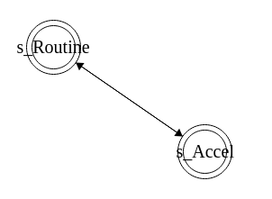
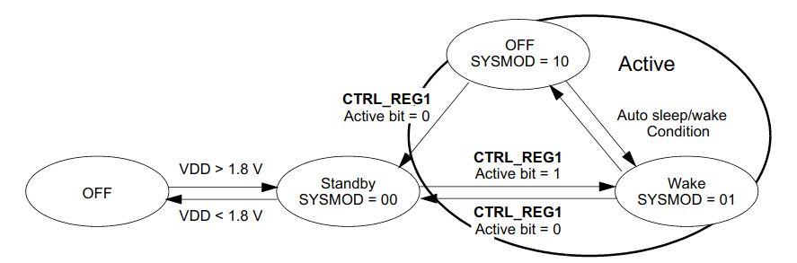
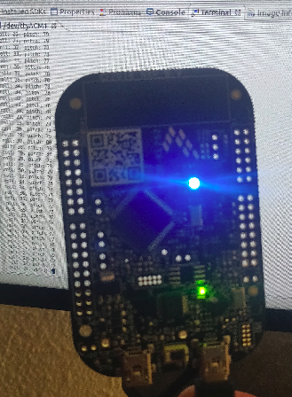
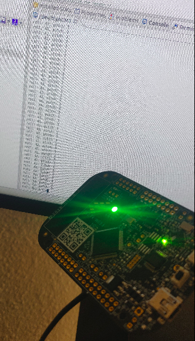

# Sensor_Fusion_PES

## Project Goal and Repository Comments

- Objective: To tie into the MMA8451Q accelerometer over I2C. Change the LED colors in response to the device orientation, and also use the LED (blinking pattern) to show sudden acceleration.

- _Contains_
Code for Final Project for Principals of Embedded Systems Software, ECEN-5813, Fall 2020
Only DEBUG and Production Target is considered for this assignment whose goal is setting up an communication with MMA8451Q Sensor

- contact arpit.savarkar@colorado.edu

## Repository for PES Final Project 

Source Code for this assignment can be found under source /

- <b>main.c - The main script which forms the application entry point to the state machine which changes LED Colors based on current Roll and Pitch of KL25Z </b>
- <b>bme.h - NXP Updated C Implemetation of the BME API based on Bit Manipulation engine Block Guide v0.3</b>
- <b>clock.h - Header file for Instantiation and functionalities for clock and TPM/PWM</b>
- <b>clock.c - Functionalities for Processor Clock and PWM with 48000 brightness level </b>
- <b>delay.h - Header File for Busy Waiting</b>
- <b>endian.h - Header file for Instantiation and functionalities to check endieanness of the Data generated from MMA8451Q</b>
- <b>global_defs.h - Debug Functions Defines </b>
- <b>i2c.h - Header file for Instantiation and functionalities for communication over I2C </b>
- <b>i2c.c - Communication Function Setup for I2C based setup and analysis </b>
- <b>i2carbiter.h - Header file for i2carbiter.h to settle a dispute or has ultimate authority in a matter in case multiple sensor update is required </b>
- <b>i2carbiter.c - Functionality to settle a dispute or has ultimate authority in a matter in case multiple sensor update is required </b>
- <b>init_sensors.h - Header file for init_sensors.c to instantiate MMA8451Q Inertial Sensor with appropriate settings. </b>
- <b>init_sensors.c - To instantiate MMA8451Q Inertial Sensor with with appropriate Setup Configurations for Interrupt on Jerk and extreme acceleration. </b>
- <b>led.h - Header file for Instantiation and functionalities for LED to interact with the PWM </b>
- <b>led.c - Instantiates the LED to interact with the PWM/TPM and adjust brightness in accordance to MMA8451Q Tilt angles (Roll, Pitch). Green : Indicates Roll, Blue  : Indicates Pitch Increasing Brightness indicates higher angles </b>
- <b>mma8451q.h - Header file for DataSheet and DataStructures to handle interaction with MMA8451Q sensor. </b>
- <b>mma8451q.c - DataSheet and DataStructures to handle interaction with MMA8451Q sensor. </b>
- <b>statemachine.h - Header file of statemachine.c defining State Machine Function Prototypes</b>
- <b>statemachine.c - File containing Statemachine functionalities implemented in accordance to Traffic Light State Machine </b>
-  </b>
- <b>sysclock.h - Header file for Instantiation and functionalities for system clock based on MCG</b>
- <b>sysclock.c - Instantiation and functionalities for system clock based on MCG</b>
- <b>systick.h - Header File for Mangement of Sytick Timer and Interrupt </b>
- <b>systick.c - Sytick Timer every millisecond and Intrrupt </b>

## Project Comments

- The MMA8451Q is a smart, low-power, three-axis, capacitive, micromachined accelerometer with 14 bits of resolution. This accelerometer is packed with embedded functions with flexible user programmable options, configurable to two interrupt pins.The device is configured to generate inertial wakeup interrupt signals from any combination of the configurable embedded functions allowing the MMA8451Q to monitor events.

-  </b>

- The State Machine has only 2 states, "Routine" which updates the LED's in accordance to the Tilt Angles and "Accel" which Flashes LED's according to current Angle, to indicate a Sudden Jerk is detected. The flags linked to these are updated in the IRQ Handlers.

- Motion Detection (Jerk/Jolt) is used to simply alert the main processor that the device is currently in use has caused a sudden acceleration. When the acceleration exceeds a set threshold the motion interrupt is asserted (In this repository it is 4g). A motion can be a fast moving shake or a slow moving tilt. This will depend on the threshold (4g) and timing values configured for the event. The motion detection function is used in this project to analyze static acceleration changes or faster jolts.

- RGB LED's on the processor react to the Acceleration values calculating Roll and Pitch with the processor is currently at by changing the Brightness of the Green LED (Roll) and Blue LED (Pitch) relating to higher brightness meaning for higher Angle. 

- Motion Detection for sudden acceleration: A Processor is considered to be in sudden acceleration if at any instant of time the acceleration along the X,Y axis is greater than 2G(G=9.81 m/s^2). The Processor is Configured to cause an interrupt and "FLASH" the LED's with on appropirate color to indicate that sudden acceleration was detected. 

- PWM Brightness for LED's has been 48000 Levels, which increase in brightness as the Processor KL25Z is raised in angles.

- The Calculations for PWM, Jerk Constraints can be found in the appropriate code under source directiory. 

## Pitch 

-  </b>

- 

## Roll 

-  </b>

- 

## Sudden Jerk/Acceleration

- 

